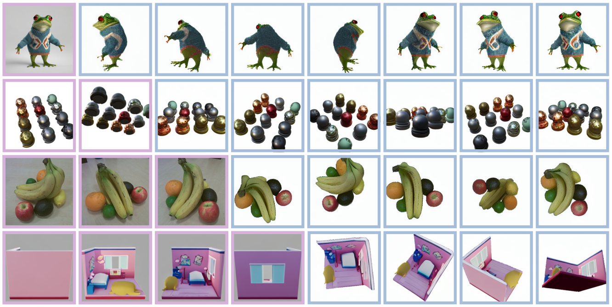

[comment]: <> (# EscherNet: A Generative Model for Scalable View Synthesis)

<!-- PROJECT LOGO -->

<p align="center">

  <h1 align="center">EscherNet: A Generative Model for Scalable View Synthesis</h1>
  <p align="center">
    <a href="https://kxhit.github.io"><strong>Xin Kong</strong></a>
    ·
    <a href="https://shikun.io"><strong>Shikun Liu</strong></a>
    ·
    <a href="https://shawlyu.github.io/"><strong>Xiaoyang Lyu</strong></a>
    ·
    <a href="https://marwan99.github.io/"><strong>Marwan Taher</strong></a>
    ·
    <a href="https://xjqi.github.io/"><strong>Xiaojuan Qi</strong></a>
    ·
    <a href="https://www.doc.ic.ac.uk/~ajd/"><strong>Andrew J. Davison</strong></a>
  </p>

[comment]: <> (  <h2 align="center">PAPER</h2>)
  <h3 align="center"><a href="https://kxhit.github.io/eschernet/EscherNet.pdf">Paper</a> | <a href="https://kxhit.github.io/EscherNet">Project Page</a></h3>
  <div align="center"></div>

<p align="center">
  <a href="">
    
  </a>
</p>
<p align="center">
EscherNet is a <strong>multi-view conditioned</strong> diffusion model for view synthesis. EscherNet learns implicit and generative 3D representations coupled with the <strong>camera positional encoding (CaPE)</strong>, allowing precise and continuous relative control of the camera transformation between an <strong>arbitrary number of reference and target views</strong>.
</p>
<br>

##  Install
```
conda env create -f environment.yml -n eschernet
conda activate eschernet
```

##  Demo
Run demo to generate randomly sampled 25 novel views from (1,2,3,5,10) reference views:
```commandline
bash eval_eschernet.sh
```

##  Camera Positional Encoding (CaPE)
CaPE is applied in self/cross-attention for encoding camera pose info into transformers. The main modification is in `diffusers/models/attention_processor.py`. 

To quickly check the implementation of CaPE (6DoF and 4DoF), run:
```
python CaPE.py
```

##  Training
### Objaverse 1.0 Dataset
Download Zero123's Objaverse Rendering data:
```commandline
wget https://tri-ml-public.s3.amazonaws.com/datasets/views_release.tar.gz
```
Filter Zero-1-to-3 rendered views (empty images):
```commandline
cd scripts
python objaverse_filter.py --path /data/objaverse/views_release
```

### Launch training
Configure accelerator (8 A100 GPUs, bf16):
```commandline
accelerate config
```

Choose 4DoF or 6DoF CaPE (Camera Positional Encoding):
```commandline
cd 4DoF or 6DoF
```

Launch training:

```commandline
accelerate launch train_eschernet.py --train_data_dir /data/objectverse/views_release --pretrained_model_name_or_path runwayml/stable-diffusion-v1-5 --train_batch_size 256 --dataloader_num_workers 16 --mixed_precision bf16 --gradient_checkpointing --T_in 3 --T_out 3 --T_in_val 10 --output_dir logs_N3M3B256_SD1.5 --push_to_hub --hub_model_id ***** --hub_token hf_******************* --tracker_project_name eschernet
```

For monitoring training progress, we recommand [wandb](https://wandb.ai/site) for its simplicity and powerful features.
```commandline
wandb login
```
Offline mode:
```commandline
WANDB_MODE=offline python xxx.py
```


## Evaluation
We provide [raw results](https://huggingface.co/datasets/kxic/EscherNet-Results) and two checkpoints [4DoF](https://huggingface.co/kxic/eschernet-4dof) and [6DoF](https://huggingface.co/kxic/eschernet-6dof) for easier comparison.

### Datasets
##### [GSO Google Scanned Objects](https://app.gazebosim.org/GoogleResearch/fuel/collections/Scanned%20Objects%20by%20Google%20Research)
[GSO30](https://huggingface.co/datasets/kxic/EscherNet-Dataset/tree/main): We select 30 objects from GSO dataset and render 25 randomly sampled novel views for each object for both NVS and 3D reconstruction evaluation.

##### [RTMV](https://drive.google.com/drive/folders/1cUXxUp6g25WwzHnm_491zNJJ4T7R_fum)
We use the 10 scenes from `google_scanned.tar` under folder `40_scenes` for NVS evaluation.

##### [NeRF_Synthetic](https://drive.google.com/drive/folders/1JDdLGDruGNXWnM1eqY1FNL9PlStjaKWi)
We use the all 8 NeRF objects for 2D NVS evaluation.

##### [Franka16](https://huggingface.co/datasets/kxic/EscherNet-Dataset/tree/main)
We collected 16 real world object-centric recordings using a Franka Emika Panda robot arm with RealSense D435i Camera for real world NVS evaluation.

##### [Text2Img](https://huggingface.co/datasets/kxic/EscherNet-Dataset/tree/main)
We collected Text2Img generation results from internet, [Stable Diffusion XL](https://github.com/Stability-AI/generative-models) (1 view) and [MVDream](https://github.com/bytedance/MVDream) (4 views: front, right, back, left) for NVS evaluation.

### Novel View Synthesis (NVS)
To get 2D Novel View Synthesis (NVS) results, set `cape_type, checkpoint, data_type, data_dir` and run:
```commandline
bash ./eval_eschernet.sh
```
Evaluate 2D metrics (PSNR, SSIM, LPIPS):
```commandline
cd metrics
python eval_2D_NVS.py
```

### 3D Reconstruction
We firstly generate 36 novel views with `data_type=GSO3D` by:
```commandline
bash ./eval_eschernet.sh
```
Then we adopt [NeuS](https://github.com/Totoro97/NeuS) for 3D reconstruction:
```commandline
export CUDA_HOME=/usr/local/cuda-11.8
pip install git+https://github.com/NVlabs/tiny-cuda-nn/#subdirectory=bindings/torch
cd 3drecon
python run_NeuS.py
```

Evaluate 3D metrics (Chamfer Distance, IoU):
```commandline
cd metrics
python eval_3D_GSO.py
```


## Gradio Demo
TODO.

To build locally:
```commandline
python gradio_eschernet.py
```

##  Acknowledgement
We have intensively borrow codes from the following repositories. Many thanks to the authors for sharing their codes.

- [Zero-1-to-3](https://github.com/cvlab-columbia/zero123)
- [SyncDreamer](https://github.com/liuyuan-pal/SyncDreamer)
- [MVDream](https://github.com/bytedance/MVDream)
- [NeuS](https://github.com/Totoro97/NeuS)


##  Citation
If you find this work useful, a citation will be appreciated via:

```
@article{eschernet,
    title={EscherNet: A Generative Model for Scalable View Synthesis},
  author={Kong, Xin and Liu, Shikun and Lyu, Xiaoyang and Taher, Marwan and Qi, Xiaojuan and Davison, Andrew J},
  journal={arXiv preprint arXiv:},
  year={2024}
}
```